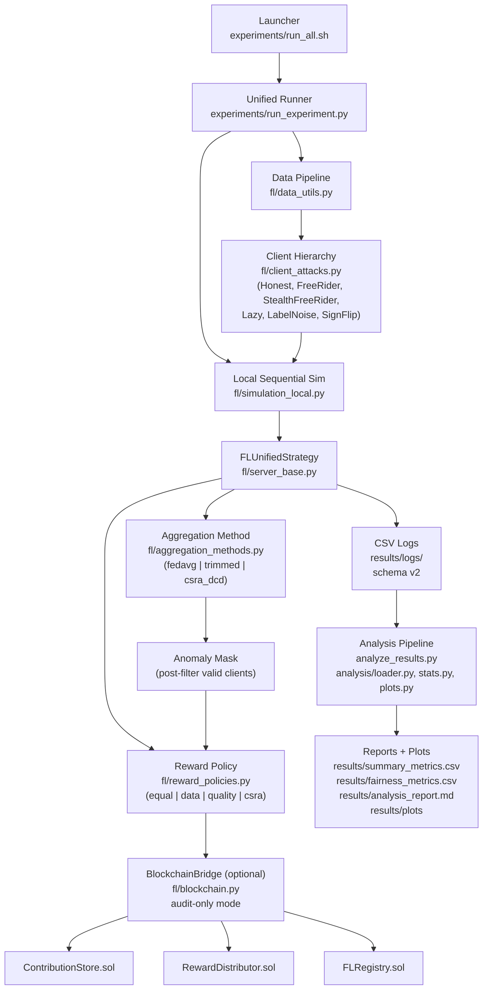

# FL-Blockchain Reward Distribution

Dự án: **Cải tiến cơ chế phân phối phần thưởng dựa trên đóng góp đa chiều trong hệ thống Federated Learning kết hợp Blockchain**.

Hệ thống mô phỏng Federated Learning bằng Flower, ghi nhận đóng góp và phân phối reward qua smart contract Solidity chạy trên Hardhat.

> **Schema v2 — refactor reward policies** _(đang triển khai trên branch `refactor/reward-policies`)_
>
> Pipeline được tái thiết kế thành 2 chiều độc lập:
> - **Aggregation method**: `fedavg | trimmed | csra_dcd`
> - **Reward policy**: `equal | data | quality | csra` (CSRA = 3-chiều `β·quality + γ·data + δ·reputation`)
>
> Blockchain đóng vai trò audit/log/distribute layer, không phải hyperparameter so sánh.
>
> Chi tiết: [`docs/PLAN.md`](docs/PLAN.md).

---

## 1. Tổng Quan Hệ Thống

Mục tiêu chính của hệ thống:

- Huấn luyện mô hình FL trên `MNIST`, `Fashion-MNIST`, `CIFAR-10`.
- Hỗ trợ kịch bản dữ liệu `IID`, `Weak Non-IID`, `Dirichlet Non-IID`.
- Mô phỏng client bất thường: `free_rider`, `stealth_free_rider`, `lazy`, `label_noise`, `sign_flip`.
- Ghi log contribution/reward/reputation/accuracy theo từng round.
- So sánh CSRA-DCD với các baseline về accuracy, fairness, reward leakage và detection.

### Kiến Trúc



### Luồng Một Round FL

1. Server gửi global parameters cho các clients.
2. Client huấn luyện local model và trả về parameters + metadata đóng góp.
3. Server tự tính update features từ params nhận được: raw update norm, normalized update score, cosine-to-reference và authenticity score.
4. CSRA-DCD dùng robust statistics, direction check và rolling suspicion để tách hard aggregation filter khỏi reward quarantine.
5. Client bị hard-filter không tham gia aggregation; client bị reward-block/quarantine nhận `reward_eth = 0`.
6. Blockchain, nếu bật, chỉ ghi audit/payout cho reward đã tính off-chain.
7. Logger ghi CSV theo round để phân tích offline.

---

## 2. Yêu Cầu Môi Trường

Khuyến nghị:

- Python `3.11`
- Node.js `20.x`
- RAM tối thiểu `8GB`, khuyến nghị `16GB`
- Git Bash/WSL/Linux shell để chạy `experiments/run_all.sh`

Kiểm tra nhanh môi trường:

```bash
python scripts/check_python.py
npm run compile
npm test
```

---

## 3. Cài Đặt

```bash
python3.11 -m venv .venv
source .venv/bin/activate
pip install --upgrade pip
pip install -r requirements.txt

npm install
npm run compile
```

Trên Windows, nên dùng Python 3.11 virtualenv và chạy script Bash bằng Git Bash hoặc WSL.

---

## 4. Khởi Động Blockchain Local

Mở terminal 1:

```bash
npx hardhat node
```

Mở terminal 2:

```bash
npm run deploy
npm run fund
npm run healthcheck
```

Nếu chỉ chạy smoke test không blockchain, có thể bỏ qua bước này.

---

## 5. Chạy Thực Nghiệm

### 5.1. Chạy Nhanh Bằng Launcher

Xem hướng dẫn:

```bash
bash experiments/run_all.sh --help
```

Các mode chính:

```bash
# In lệnh, không chạy
bash experiments/run_all.sh --full --dry-run

# Smoke test: 3 runs, không cần blockchain, mặc định 3 rounds
bash experiments/run_all.sh --smoke

# Quick test: 12 runs MNIST, mặc định 10 rounds
bash experiments/run_all.sh --quick --resume

# Full matrix: khoảng 514 runs, mặc định 30 rounds/run
bash experiments/run_all.sh --full --resume

# Full nhưng bỏ CIFAR-10 để giảm tải VM: khoảng 402 runs
bash experiments/run_all.sh --full --no-cifar --resume
```

Có thể override bằng biến môi trường:

```bash
ROUNDS=20 SEED=123 LOG_DIR=./results/logs bash experiments/run_all.sh --quick --resume
```

### 5.2. Chạy Một Experiment Đơn Lẻ (Schema v2)

Mọi experiment dùng chung **một runner duy nhất** với cờ `--aggregation` và `--reward-policy`.

M1 — FedAvg + EqualSplit (baseline trần):

```bash
python -m experiments.run_experiment \
  --dataset mnist --scenario K1 \
  --aggregation fedavg --reward-policy equal \
  --seed 42 --n-rounds 10 --no-blockchain
```

M4 — FedAvg + CSRAReward 3-chiều (ablation: chỉ reward formula):

```bash
python -m experiments.run_experiment \
  --dataset mnist --scenario K3 --dirichlet-alpha 0.1 \
  --aggregation fedavg --reward-policy csra \
  --beta 0.5 --gamma 0.3 --delta 0.2 \
  --seed 42 --n-rounds 10 --no-blockchain
```

M6 — CSRA-DCD + CSRAReward (hệ thống đầy đủ với attack):

```bash
python -m experiments.run_experiment \
  --dataset mnist --scenario K3 --dirichlet-alpha 0.1 \
  --aggregation csra_dcd --reward-policy csra \
  --beta 0.5 --gamma 0.3 --delta 0.2 \
  --attack free_rider --attack-client-ids 8,9 \
  --seed 42 --n-rounds 10 --no-blockchain
```

TrimmedMean baseline:

```bash
python -m experiments.run_experiment \
  --dataset mnist --scenario K3 --dirichlet-alpha 0.1 \
  --aggregation trimmed --reward-policy equal \
  --trim-ratio 0.1 --seed 42 --n-rounds 10 --no-blockchain
```

Toàn bộ flags: `python -m experiments.run_experiment --help`.

---

## 6. Kịch Bản Và Baseline

### Datasets

- `mnist`
- `fashion_mnist`
- `cifar10`

### Data Scenarios

- `K1`: IID.
- `K2`: Weak Non-IID.
- `K3`: Dirichlet Non-IID, dùng `--dirichlet-alpha`, khuyến nghị `0.5` và `0.1`.

### Methods (Schema v2 — Ablation 2 chiều)

Mọi cấu hình đều dùng `run_experiment.py` duy nhất với `--aggregation` × `--reward-policy`:

| ID | Aggregation | Reward Policy | Vai trò |
| --- | --- | --- | --- |
| **M1** | `fedavg` | `equal` | Baseline trần |
| **M2** | `fedavg` | `data` | Bias data quantity |
| **M3** | `fedavg` | `quality` | Bias quality (nhạy noise) |
| **M4** | `fedavg` | `csra` | Ablation: chỉ reward formula |
| **M5** | `csra_dcd` | `equal` | Ablation: chỉ filtering |
| **M6** | `csra_dcd` | `csra` | **Hệ thống đề xuất** |

Attack types: `clean | free_rider | stealth_free_rider | lazy | label_noise | sign_flip` (via `--attack`).

---

## 7. CSRA Trong Hệ Thống

### CSRA-DCD

CSRA-DCD hiện dùng server-side update features:

```text
delta_i = local_params_i - global_params
raw_update_norm_i = ||delta_i||_2
normalized_update_score_i = raw_update_norm_i / relative_server_known_data_size_i
cosine_to_reference_i = cosine(delta_i, median_reference_delta)
authenticity_score_i = std(delta_i)
raw_update_norm_z_i = upper_tail_mad_z(raw_update_norm_i)
```

Server dùng MAD robust z-score để phát hiện anomaly magnitude:

```text
z_i = |score_i - median(score)| / (1.4826 * MAD)
```

Ngoài hard anomaly filter, hệ thống còn có reward quarantine qua các tín hiệu:

- zero data/data mismatch.
- direction anomaly.
- low-quality outlier.
- inefficient update: raw norm cực lớn nhưng local quality không vượt median.
- low-authenticity outlier.
- rolling suspicion score.

Client bị hard anomaly không tham gia aggregation. Client bị reward quarantine vẫn có thể được ghi log/audit nhưng nhận `reward_eth = 0`.

### CSRA Reward

CSRAReward dùng ba thành phần đã chuẩn hóa:

```text
score_i = beta * quality_alignment_i
        + gamma * server_known_data_size_i
        + delta * reputation_i
```

Trong runner hiện tại:

- `quality` cho reward là alignment/cosine do server tính từ update, không phải local delta-loss client tự báo.
- `data_size` ưu tiên server-known partition size trong simulation, và log thêm reported/server-known size để phát hiện mismatch.
- `reputation` là tín hiệu lịch sử từ blockchain nếu bật, mặc định `0.5` khi chạy `--no-blockchain`.
- CSV schema v2 tách `ground_truth_honest` (nhãn kịch bản), `reward_eligible` (đủ điều kiện nhận reward sau filtering/quarantine) và `is_honest` (legacy alias của `reward_eligible`).
- Các cột `reward_component_*` log thành phần đang thật sự dùng: policy `data`/`quality` chỉ điền component tương ứng; policy `csra` điền ba component sau weighting.
- Khi bật blockchain, lỗi đọc reputation từ contract mặc định **fail-closed**: client đó không được xem là đủ điều kiện nhận reward trong round lỗi. `BlockchainConfig.reputation_fail_open=True` chỉ nên dùng để debug môi trường local không ổn định.

**Sweep β cho CSRAReward:**

```bash
for beta in 0.3 0.5 0.7; do
  gamma=$(python -c "print(round((1 - $beta) * 3/5, 4))")
  delta=$(python -c "print(round((1 - $beta) * 2/5, 4))")
  python -m experiments.run_experiment \
    --dataset mnist --scenario K3 --dirichlet-alpha 0.1 \
    --aggregation fedavg --reward-policy csra \
    --beta $beta --gamma $gamma --delta $delta \
    --seed 42 --n-rounds 10 --no-blockchain
done
```

---

## 8. Phân Tích Kết Quả

Log CSV được ghi tại:

```text
results/logs/
```

Chạy phân tích:

```bash
python analyze_results.py --report
```

Output chính:

- `results/summary_metrics.csv`
- `results/fairness_metrics.csv`
- `results/analysis_report.md`
- `results/plots/*.png`

Metrics đáng chú ý:

- Final accuracy, peak accuracy.
- Convergence round: round đầu tiên đạt `95%` peak accuracy và ổn định trong 5 rounds.
- Jain index, Gini, fairness gap.
- Reward-quality correlation.
- False positive detection/quarantine rate.
- Attack detection/reward-block rate.
- Reward leakage.
- Data mismatch/authenticity/inefficient-update/suspicion diagnostics.

---

## 9. Cấu Trúc Thư Mục

```text
contracts/      Smart contracts Solidity
fl/             Core modules:
                  - reward_policies.py    (4 reward policies)
                  - aggregation_methods.py (3 aggregation strategies)
                  - client_attacks.py      (Honest + 5 attack subclasses)
                  - server_base.py         (Unified strategy)
                  - simulation_local.py    (Sequential sim, no ray)
                  - blockchain.py          (Audit-only bridge)
                  - logger.py              (CSV schema v2)
                  - data_utils.py, models.py, metrics.py, normalization.py, config.py
experiments/    run_experiment.py (unified) + run_all.sh (launcher)
analysis/       Loader, statistics, plots, report generator
scripts/        Deploy, fund, healthcheck, environment check
tests/          Unit tests, contract tests, integration tests
results/        Logs, summaries, plots
docs/           PLAN.md (refactor plan), SETUP.md (env)
```

---

## 10. Kiểm Thử

```bash
python -m pytest tests/unit -q
python -m pytest tests/integration -q
npm test
python -m compileall fl experiments analysis tests -q
```

`tests/integration` sẽ skip khi Hardhat node chưa chạy. Để chạy full bridge flow, mở `npx hardhat node`, deploy contracts rồi chạy lại integration test.

Kiểm tra dry-run matrix:

```bash
bash experiments/run_all.sh --smoke --dry-run
bash experiments/run_all.sh --quick --dry-run
bash experiments/run_all.sh --full --dry-run
```

---

## 11. Giới Hạn Hiện Tại

- Reward quality hiện dựa nhiều vào alignment/cosine với reference update. Trong Non-IID mạnh, honest client có class hiếm vẫn có nguy cơ bị đánh giá thấp.
- Server-known data size là giả định hợp lý cho simulation, nhưng cần ghi rõ trong báo cáo khi bàn về FL thực tế.
- Reputation on-chain hiện chỉ là EWMA fixed-point đơn giản từ capped data commitment và quality audit signal; chưa phải cơ chế reputation học/adaptive đầy đủ.
- Full matrix nhiều dataset/seed/attack có thể tốn nhiều giờ trên VM, nên chạy `--smoke` và `--quick` trước.
- Blockchain local cần Hardhat node và deployed contracts khi chạy các config có reward on-chain; nếu không có node, integration Python sẽ skip có kiểm soát.

---

**Tác giả:** Phan Hồng Đạt - 23520266
