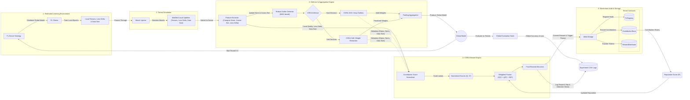

# Sơ đồ Kiến trúc Hệ thống FL-Blockchain CSRA

Sơ đồ dưới đây được viết bằng ngôn ngữ Mermaid theo chiều ngang (Left-to-Right).

```mermaid
flowchart LR
    %% 1. FL Layer
    subgraph FL_Layer [1. Federated Learning Environment]
        Server[FL Server Strategy]
        Client[FL Clients]
        
        Server -- "Distribute Global Model" --> Client
        Client -- "Train Local Epochs" --> RawUpdate["Local Tensors, Loss Delta & Data Size"]
    end

    %% 2. Threat Layer
    subgraph Threat_Layer [2. Threat Simulation]
        Injector[Attack Injector]
        RawUpdate -- "Passes Through" --> Injector
        Injector -- "Simulate Attacks" --> PoisonedUpdate["Modified Local Updates \n(Tensors, Loss Delta, Data Size)"]
    end

    %% 3. Defense & Aggregation
    subgraph Defense_Layer [3. Defense & Aggregation Engine]
        Extract["Feature Extractor \n(Compute Norm, Cosine Sim, Loss Delta)"]
        MAD["Robust Outlier Detector \n(MAD-based)"]
        Branch{CSRA Defense}
        HardFilter[CSRA-DCD: Drop Outliers]
        SoftPenalty[CSRA-Soft: Weight Reduction]
        FedAvg[FedAvg Aggregation]
        
        PoisonedUpdate -- "Submit to Server" --> Extract
        Extract -- "Update Norm & Cosine Sim" --> MAD
        MAD --> Branch
        
        Branch -- "Hard Decision" --> HardFilter
        Branch -- "Soft Decision" --> SoftPenalty
        
        HardFilter -- "Valid Weights" --> FedAvg
        SoftPenalty -- "Penalized Weights" --> FedAvg
    end

    %% Global Model Loop & Logging
    GlobalModel((Global Model))
    EvalNode[Global Evaluation Node]
    Logger[(Experiment CSV Logs)]
    
    FedAvg -- "Produce Global Model" --> GlobalModel
    GlobalModel -- "Evaluate on Testset" --> EvalNode
    EvalNode -- "Global Accuracy & Loss" --> Logger
    GlobalModel -- "Start Round t+1" --> Server

    %% 4. Reward Layer
    subgraph Reward_Layer [4. CSRA Reward Engine]
        Norm[Contribution Score Normalizer]
        NormScores("Normalized Scores (Q', D')")
        Fusion["Weighted Fusion: \n β(Q') + γ(D') + δ(R')"]
        Alloc[Final Reward Allocation]
        
        Extract -- "Local Quality, Loss Delta, Data Size" --> Norm
        HardFilter -. "Metadata (Status, Norm, Data Size)" .-> Norm
        SoftPenalty -. "Metadata (Status, Norm, Data Size)" .-> Norm
        
        Norm -- "Scale values" --> NormScores
        NormScores --> Fusion
        Fusion --> Alloc
    end
    
    Alloc -- "Log Reward, Rep & Detection Status" --> Logger

    %% 5. Blockchain Layer
    subgraph Blockchain_Layer [5. Blockchain Audit & Storage]
        Bridge[Web3 Bridge]
        subgraph SmartContracts [Smart Contracts]
            direction TB
            Registry[(FLRegistry)]
            Store[(ContributionStore)]
            Payout[(RewardDistributor)]
        end
        
        Alloc -- "Commit Reward & Trigger Payout" --> Bridge
        Bridge -- "Register Node" --> Registry
        Bridge -- "Record Contributions" --> Store
        Bridge -- "Transfer Tokens" --> Payout
    end

    %% Feedback Loop
    RepScore("Reputation Score (R')")
    Store -- "Contribution History" --> RepScore
    RepScore -- "Updated Reputation" --> Fusion
```
